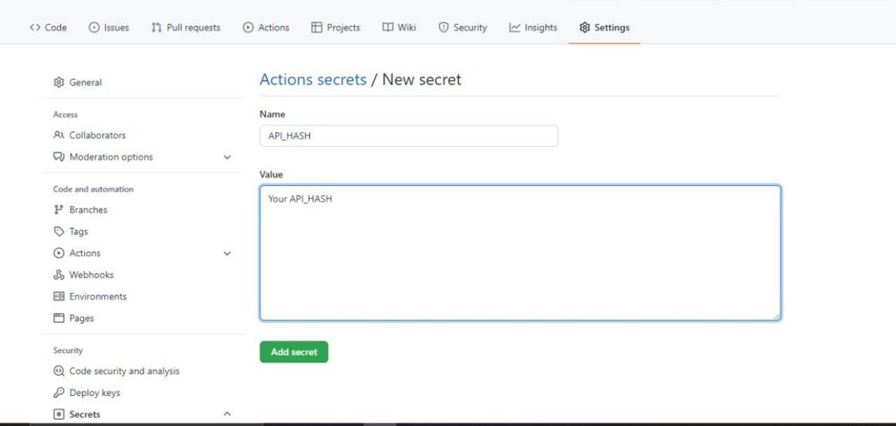

<h1>Miku-MentionAll_Bot Manually Deploy via Heroku Github Actions</h1>
<h3>This page will tell you how to deploy Miku-MentionAll_Bot to heroku on Github Actions</h3><i><b>(This is for Developers.. If You are not, Deploy Bot using Heroku Deploy URL)</b></i>

#### Steps

🎈1. **Fork this Repo**

🎈2. **Go to Repository `Settings` -> `Secrets`**
    
    
🎈3. **Now set the below Variables in the Github Repository Secrets**
    [Environmental Variables](#environment-variables)   
    
🎈4. **After filling the Required vars .... go to Actions and then tap on Run the Workflow**
       

🎉5. **now wait it for it to deployed to heroku and Check app logs and Turn on Workers If OFF** **if everything is OK then send /start to the bot or try other cmds**...

## Environment Variables

### 🔴Required Environmental Variables... MUST BE GIVEN....

| Variable | Description |
| :---: | :---: |
| `HEROKU_EMAIL` | Just Give the email you used for Heroku Account|
| `HEROKU_API_KEY` | Get it from [Heroku](https://dashboard.heroku.com/account/applications/authorizations/new) |
| `HEROKU_APP_NAME` | Heroku app name that needs to be Updated or Created (Should be in lowercase) |
| `TOKEN` | Create a bot using [@BotFather](https://telegram.dog/BotFather), and get the  API token. |
| `APP_ID` | Get this value from [Telegram](my.telegram.org). |
| `API_HASH` | Get this value from [Telegram](my.telegram.org). |
| `BOT_USERNAME` | Your bot username without @. |
| `OWNER_USERNAME` | Your Telegram username without @. |
